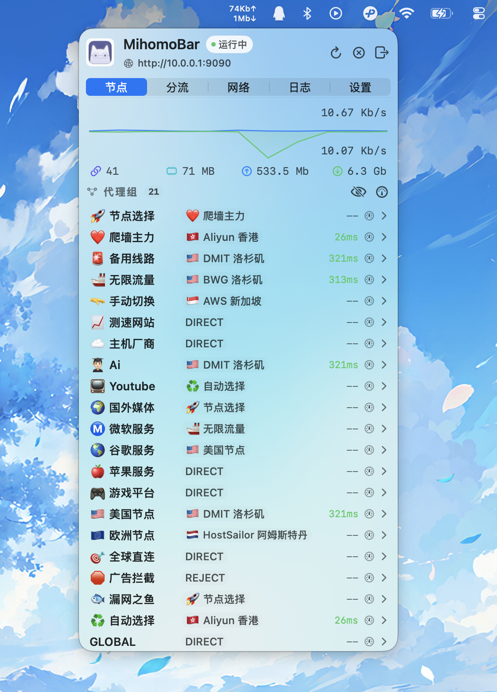

## MihomoBar

原生 macOS 菜单栏远程控制器（SwiftUI + AppKit），面向 Clash / Mihomo 。

---

Fork 自 [Sitoi / ClashBar](https://github.com/Sitoi/ClashBar) ，移除了所有代理功能，变成一个菜单栏的 Mihomo 内核远程控制器，连接你软路由的 OpenClash 。
你可以在菜单栏中完成远程控制器连接、节点切换、规则刷新、连接排障与日志查看。 


## 🌐 OpenWrt 菜单栏流量监控

MihomoBar 支持将**菜单栏速率显示**切换为 OpenWrt 某个接口的实时流量；  
面板内的火花图、总流量、连接视图仍然显示 Clash / Mihomo 内核流量。

开启路径：

- `System` → `菜单栏显示 OpenWrt 流量`
- 填写 `OpenWrt 主机 / 接口 / 用户名 / 密码`

> [!IMPORTANT]
> MihomoBar 当前通过 OpenWrt 的 HTTP `/ubus` 轮询接口流量。
> 即使使用的是 `root` 账号，HTTP 登录会话仍然受 `rpcd ACL` 限制，并不是默认拥有全部 `ubus` 读取权限。

如果未配置 ACL，常见现象是菜单栏始终显示 `0K`，或日志出现：

```text
OpenWrt 流量轮询失败: OpenWrt RPC failed: status=6
```

这通常表示当前账号缺少以下 RPC 权限：

- `network.device` → `status`
- `file` → `read`

建议在 OpenWrt 上新增 ACL 文件：

```text
/usr/share/rpcd/acl.d/MihomoBar-openwrt-traffic.json
```

示例内容：

```json
{
  "MihomoBar-openwrt-traffic": {
    "description": "Allow MihomoBar to read interface traffic",
    "read": {
      "ubus": {
        "network.device": [ "status" ],
        "file": [ "read" ]
      }
    }
  }
}
```

修改后重启 `rpcd`：

```sh
/etc/init.d/rpcd restart
```

> [!NOTE]
> 不同 OpenWrt 固件对 `rpcd` 登录用户与 ACL 角色的绑定方式可能略有差异。
> 如果 ACL 文件已添加，但仍返回 `status=6`，通常还需要检查当前登录账号是否已正确关联到对应 `read` 权限组。

## 🗺️ 功能导航

- 🧭 `Proxy`：实时速率、连接数、内存、配置入口、系统代理开关
- 📚 `Rules`：规则统计、规则刷新、Provider 更新
- 🌐 `Activity`：连接过滤、关闭单连接、关闭全部连接
- 🪵 `Logs`：日志级别过滤、关键词检索、日志复制
- ⚙️ `System`：语言、状态栏样式、`allow-lan` / `ipv6` / `log-level`、端口设置

## ❓ 常见问题

### 1) macOS 提示“已损坏”或“无法验证开发者” 🔒

**现象**：应用首次启动被系统拦截。  
**原因**：macOS Gatekeeper 对未公证应用的默认安全策略。

**处理步骤**

1. 将应用放置到 `/Applications/MihomoBar.app`。
2. 打开 **系统设置 → 隐私与安全性**，点击「仍要打开（Open Anyway）」。
3. 若仍被拦截，可移除隔离标记后重试：

```bash
sudo xattr -r -d com.apple.quarantine /Applications/MihomoBar.app
```

## 📄 许可证

本项目采用 `GPL-3.0 license`，详见 [LICENSE](LICENSE)。
